# 📖 NITK ME318 Centrifugal Pump — Complete Project Bible

> **Course:** ME318 — Turbomachinery Lab  
> **Institution:** NITK Surathkal  
> **Year:** 2026  
> **Software:** Autodesk Fusion 360 (Mac), ANSYS Fluent (CFD)  
> **File:** `pump_model.py` — single Python script, generates the entire pump

---

## Table of Contents

1. [Project Overview](#1-project-overview)
2. [Engineering Theory](#2-engineering-theory)
3. [Master Specification Sheet](#3-master-specification-sheet)
4. [Fusion 360 API — Key Concepts](#4-fusion-360-api--key-concepts)
5. [Script Architecture](#5-script-architecture)
6. [Phase 1 — Sketches (Lines 75–169)](#6-phase-1--sketches)
7. [Phase 2 — Impeller Solid (Lines 171–204)](#7-phase-2--impeller-solid)
8. [Phase 3 — Volute Loft (Lines 206–226)](#8-phase-3--volute-loft)
9. [Phase 4 — STEP Export (Lines 228–260)](#9-phase-4--step-export)
10. [Bugs Fixed from Original Script](#10-bugs-fixed-from-original-script)
11. [Dimension Reference Table](#11-dimension-reference-table)
12. [Vane Geometry — Full Math Derivation](#12-vane-geometry--full-math-derivation)
13. [Volute Geometry — Full Math Derivation](#13-volute-geometry--full-math-derivation)
14. [How to Run (Step-by-Step with Screenshots)](#14-how-to-run-step-by-step)
15. [CFD Preparation (ANSYS Fluent)](#15-cfd-preparation)
16. [Troubleshooting Encyclopedia](#16-troubleshooting-encyclopedia)
17. [File Inventory](#17-file-inventory)
18. [Glossary](#18-glossary)

---

## 1. Project Overview

This project automates the creation of a **centrifugal pump** 3D model inside **Autodesk Fusion 360** using a single Python script. When you click "Run" in Fusion 360, the script:

1. Creates an **impeller** — the rotating component with 6 backward-curved vanes
2. Creates a **volute casing** — the snail-shell housing that collects fluid
3. Exports a **STEP file** to your Desktop for use in AutoCAD or ANSYS

### Why Script Instead of Manual CAD?

| Manual CAD | Script |
|-----------|--------|
| 2–4 hours of clicking | 5 seconds to run |
| Easy to make dimension errors | All dimensions hardcoded from spec |
| Hard to reproduce | Run on any machine, same result |
| No version control | Track changes with Git |

### What is a Centrifugal Pump?

A centrifugal pump converts **rotational energy** (from a motor-driven shaft) into **fluid flow energy**. The impeller spins, accelerating fluid outward by centrifugal force. The volute casing collects this high-velocity fluid and converts velocity into pressure (Bernoulli's principle).

```
                    ┌──────────────┐
     Fluid In       │   VOLUTE     │
    (Suction Eye)   │   CASING     │    Fluid Out
   ───────────►     │  ┌───────┐   │   ──────────►
     18 mm dia      │  │IMPELLER│   │    10 mm dia
                    │  │  ⟳    │   │   (Discharge)
                    │  │ 6 vanes│   │
                    │  └───────┘   │
                    └──────────────┘
```

---

## 2. Engineering Theory

### 2.1 Velocity Triangles

At the impeller outlet (tip), three velocities define pump performance:

- **U₂** (blade tip speed) = π × D₂ × N / 60
- **V₂** (absolute velocity) — fluid velocity in the lab frame
- **W₂** (relative velocity) — fluid velocity relative to the blade

The **blade exit angle β₂** determines the pump characteristic:
- β₂ < 90° → **Backward-curved** (our design) — stable, high efficiency
- β₂ = 90° → Radial — moderate
- β₂ > 90° → Forward-curved — unstable, high head

Our vanes sweep from **0° to -25°**, giving β₂ ≈ 30–35°. This is a textbook backward-curved design.

### 2.2 Volute Area Law

The volute cross-sectional area grows linearly with angle θ to maintain **constant circumferential velocity**:

```
A(θ) = (Q × θ) / (2π × V_θ)
```

Where:
- Q = volumetric flow rate
- V_θ = circumferential velocity (kept constant)
- θ = angle from tongue (cutwater)

This is why our profile diameters increase: 3 → 4 → 5.5 → 7 mm as θ goes from 0° → 270°.

### 2.3 Pressure Recovery (Diffuser)

The outlet section expands from ∅7 mm (throat) to ∅10 mm (exit) over 20 mm length. This acts as a **conical diffuser** converting kinetic energy to pressure:

```
Diffuser half-angle = arctan((10-7) / (2×20)) ≈ 4.3°
```

An 8° total included angle is within the optimal range (6–12°) for attached flow without separation.

### 2.4 Cutwater Clearance

The gap between impeller tip (R = 23 mm) and volute tongue (R = 29 mm):

```
Clearance = 29 - 23 = 6 mm
```

This 6 mm radial gap is critical to:
- Minimize pressure pulsations
- Reduce acoustic noise
- Prevent mechanical interference

---

## 3. Master Specification Sheet

### 3.1 Impeller

| Parameter | Symbol | Value | In Script (cm) |
|-----------|--------|-------|-----------------|
| Outer Diameter | D₂ | 46.00 mm | `IMP_OR = 2.3` |
| Outer Radius | R₂ | 23.00 mm | 2.3 cm |
| Inlet Eye Diameter | D₁ | 18.00 mm | 0.9 cm radius |
| Hub/Shaft Diameter | — | 10.00 mm | `HUB_R = 0.5` |
| Number of Vanes | Z | 6 | `VANE_N = 6` |
| Vane Thickness | t | 2.00 mm | `VANE_T = 0.2` |
| Blade Height | b | 12.00 mm | `BLADE_H = 1.2` |
| Back Plate Thickness | — | 2.00 mm | `PLATE_T = 0.2` |
| Total Height | — | 14.00 mm | `TOTAL_H = 1.4` |

### 3.2 Volute Casing — Spiral Markers

| Marker | Angle (θ) | Radius (R) | Profile ∅ | Script Radius (cm) |
|--------|-----------|------------|-----------|---------------------|
| **29** | 0° (Start/Tongue) | 29.00 mm | 3.00 mm | 0.150 |
| **30** | 90° (Top) | 30.00 mm | 4.00 mm | 0.200 |
| **31** | 180° (Left) | 31.00 mm | 5.50 mm | 0.275 |
| **32** | 270° (Bottom) | 32.00 mm | 7.00 mm | 0.350 |
| **Exit** | End of outlet | — | 10.00 mm | 0.500 |

### 3.3 Discharge

| Parameter | Value | Script (cm) |
|-----------|-------|-------------|
| Outlet Extension | 20.00 mm (straight vertical) | 2.0 cm |
| Exit Diameter | 10.00 mm | `EXIT_R = 0.50` |
| Path Constraint | Tangent (spiral → outlet) | Natural spline curvature |
| Outlet End Coordinate | (0, -52 mm) | `OUTLET_Y = -5.20` |

### 3.4 Key Derived Values

| Quantity | Calculation | Result |
|----------|-------------|--------|
| Cutwater Clearance | 29 − 23 | 6 mm |
| Diffuser Angle | arctan(3 / 40) | ≈ 4.3° half-angle |
| Vane Angular Spacing | 360° / 6 | 60° per vane |
| Vane Angular Sweep | hub 0° → rim −25° | 25° backward |
| Spiral Growth Rate | (32−29) / 270° | 0.011 mm/degree |

---

## 4. Fusion 360 API — Key Concepts

### 4.1 The #1 Gotcha: Units Are Centimeters

> **Fusion 360's internal API uses centimeters for ALL linear dimensions.**

The UI might show millimeters, but every `ValueInput.createByReal()` and `Point3D.create()` call uses **cm**. This was the biggest bug in the original script.

```python
# ❌ WRONG — this creates a 23 cm radius circle (230 mm!)
circles.addByCenterRadius(center, 23.0)

# ✅ CORRECT — 23 mm = 2.3 cm
circles.addByCenterRadius(center, 2.3)
```

### 4.2 Sketches, Profiles, and Extrusions


- **Sketch** = a 2D drawing plane (lives on a plane or face)
- **Curves** = lines, arcs, circles, splines drawn in the sketch
- **Profile** = a closed region formed by curves (Fusion auto-detects these)
- **Extrude** = push a profile into 3D to create a body

### 4.3 Feature Operations

| Operation | What It Does | When We Use It |
|-----------|-------------|----------------|
| `NewBodyFeatureOperation` | Creates a new separate body | Back plate (first body) |
| `JoinFeatureOperation` | Merges into an existing body | Hub, vanes (merge into impeller) |
| `CutFeatureOperation` | Subtracts from existing body | Inlet eye (not used in current version) |

### 4.4 Auto-Projection Problem

When you create a sketch on a **face** or a plane that intersects existing bodies, Fusion automatically projects the body's edges into the sketch. This creates unexpected extra curves and profiles, causing `profiles.item(0)` to grab the wrong shape.

**Our solution:** Create ALL sketches **before** any extrusions. No bodies exist → nothing to project.

```
Timeline:
  [skDisc] → [skHub] → [skVane] → [skPath] → [volute sketches]
                                                      ↓
                                              No bodies yet = SAFE
                                                      ↓
  [Extrude disc] → [Extrude hub] → [Extrude vane] → [Pattern] → [Loft volute]
```

### 4.5 Circular Pattern

Instead of creating 6 individual vanes (error-prone), we create **one vane** and use `circularPatternFeatures` to replicate it 6 times around the Z axis at 60° intervals.

```python
cpInput.quantity = val(6)           # 6 total instances (including original)
cpInput.totalAngle = val(2 * math.pi)  # spread over 360°
cpInput.isSymmetric = False         # all in one direction
```

### 4.6 Loft Feature

A loft connects multiple 2D profiles (cross-sections) to create a smooth 3D shape. Think of it as stretching a skin over wireframe rings.

```
Section 1    Section 2    Section 3    Section 4    Section 5
  ∅3mm        ∅4mm        ∅5.5mm       ∅7mm        ∅10mm
   ○            ○            ○            ○            ○
    \           |           |           |           /
     \──────────┴───────────┴───────────┴──────────/
                    LOFTED VOLUTE BODY
```

An optional **centerline** (the spiral spline) guides the loft along a curved path instead of taking a straight shortcut between sections.

### 4.7 Construction Planes Along Path

`setByDistanceOnPath(curve, fraction)` creates a plane perpendicular to a curve at a specified fraction (0.0 = start, 1.0 = end):

```python
planeIn.setByDistanceOnPath(spline, val(0.29))  # roughly at 90° position
plane = conPlanes.add(planeIn)
```

We use fractions `[0.01, 0.29, 0.58, 0.88, 0.99]` estimated from arc-length ratios.

---

## 5. Script Architecture

### 5.1 High-Level Flow

```mermaid
flowchart TD
    START["run(context)"] --> SETUP["App & Design Setup<br/>Lines 26–73"]
    SETUP --> P1["PHASE 1: Sketches<br/>Lines 75–169"]
    P1 --> P1A["1A: Disc circle"]
    P1 --> P1B["1B: Hub circle"]
    P1 --> P1C["1C: Vane banana shape"]
    P1 --> P1D["1D: Spiral spline"]
    P1 --> P1E["1E: Volute planes + circles"]
    P1 --> P2["PHASE 2: Impeller<br/>Lines 171–204"]
    P2 --> P2A["2A: Extrude disc (NewBody)"]
    P2A --> P2B["2B: Extrude hub (Join)"]
    P2B --> P2C["2C: Extrude vane (Join)"]
    P2C --> P2D["2D: Circular pattern ×6"]
    P2D --> P3["PHASE 3: Volute Loft<br/>Lines 206–226"]
    P3 --> P4["PHASE 4: Export STEP<br/>Lines 228–260"]
    P4 --> DONE["✅ Success Message"]

    style P1 fill:#2d5a27,stroke:#333
    style P2 fill:#1a4a6e,stroke:#333
    style P3 fill:#6e4a1a,stroke:#333
    style P4 fill:#4a1a6e,stroke:#333
```



### 5.2 Bodies Created

| Body | Type | Made From |
|------|------|-----------|
| **Impeller** | Single unified body | Disc + Hub + 6 Vanes (all joined) |
| **Volute** | Separate body | Loft of 5 cross-sections |

### 5.3 Sketch Inventory

| Sketch Variable | Plane | Contents | Profile Count |
|----------------|-------|----------|---------------|
| `skDisc` | XY | One circle R=2.3 | 1 |
| `skHub` | XY | One circle R=0.5 | 1 |
| `skVane` | XY | 2 arcs + 2 lines (banana) | 1 |
| `skPath` | XY | Fitted spline (19 spiral pts + 1 outlet) | 0 (path only) |
| Volute sk ×5 | Construction planes | One circle each | 1 each |

**Total sketches:** 9  
**Total construction planes:** 5

---

## 6. Phase 1 — Sketches

### 6.1 Back Plate Sketch (Line 82–83)

```python
skDisc = sketches.add(xyPlane)
skDisc.sketchCurves.sketchCircles.addByCenterRadius(origin, IMP_OR)  # R=2.3 cm
```

A single circle on the XY plane at the origin. When extruded, this becomes the solid back plate of the impeller.

### 6.2 Hub Sketch (Line 86–87)

```python
skHub = sketches.add(xyPlane)
skHub.sketchCurves.sketchCircles.addByCenterRadius(origin, HUB_R)  # R=0.5 cm
```

Separate sketch (not on the same sketch as the disc) to avoid profile confusion. The hub is the central shaft mounting point.

### 6.3 Vane Sketch (Lines 94–131) — The Most Complex Part

This creates the "banana" shape — a 2 mm thick backward-curved blade profile.

**Strategy:** Define the vane *centerline* as a curve from hub to rim, then offset it by ±1 mm (half thickness) to create the leading and trailing edges.

#### Centerline Definition

Three points define the backward curve:

| Station | Radius | Angle | Purpose |
|---------|--------|-------|---------|
| Hub | 0.5 cm (5 mm) | 0° | Start — perpendicular to radius |
| Midspan | 1.4 cm (14 mm) | −12° | Intermediate curvature |
| Rim | 2.3 cm (23 mm) | −25° | Exit — swept backward |

The negative angles mean the blade trails behind the rotation direction (backward-curved).

#### Edge Offset Calculation

At each radius `r`, the angular half-thickness is:

```
δθ = arctan(half_thickness / r)  ≈  half_thickness / r  (small angle approx.)
```

```python
delta_deg = math.degrees(half_t / r)  # half_t = 0.1 cm
```

| Station | Radius | δθ (degrees) | Leading Angle | Trailing Angle |
|---------|--------|-------------|---------------|----------------|
| Hub | 0.5 cm | 11.46° | +11.46° | −11.46° |
| Mid | 1.4 cm | 4.09° | −7.91° | −16.09° |
| Rim | 2.3 cm | 2.49° | −22.51° | −27.49° |

#### Drawing Sequence

```python
# Two 3-point arcs (leading and trailing edges)
skVane.sketchCurves.sketchArcs.addByThreePoints(lead_pts[0], lead_pts[1], lead_pts[2])
skVane.sketchCurves.sketchArcs.addByThreePoints(trail_pts[0], trail_pts[1], trail_pts[2])

# Two straight lines (end caps at hub and rim)
skVane.sketchCurves.sketchLines.addByTwoPoints(lead_pts[0], trail_pts[0])
skVane.sketchCurves.sketchLines.addByTwoPoints(lead_pts[2], trail_pts[2])
```

This creates one closed loop → one profile → the banana shape.

#### Vane End-Cap Dimensions

| End | Width (chord) | Notes |
|-----|--------------|-------|
| Hub cap | ≈ 2.0 mm | At R=5mm, angular span = 22.9° |
| Rim cap | ≈ 2.0 mm | At R=23mm, angular span = 5.0° |

The vane is always 2 mm thick, but the angular span varies with radius (wider angle near hub, narrower at rim).

### 6.4 Spiral Path (Lines 134–147)

The Archimedean spiral is defined by **19 points** at 15° intervals from 0° to 270°:

```python
for deg in range(0, 271, 15):
    theta = math.radians(deg)
    r = 2.90 + 0.30 * deg / 270.0   # Linear interpolation
    splinePts.add(pt(r * math.cos(theta), r * math.sin(theta)))
```

The radius grows linearly: `R(θ) = 29 + (32-29) × θ/270`

Plus one outlet endpoint at `(0, -5.2)` cm.

**Total points:** 20 (19 spiral + 1 outlet)

A `sketchFittedSplines.add()` creates a smooth spline through all 20 points. The spline naturally handles the transition from spiral to vertical outlet.

### 6.5 Volute Cross-Section Planes & Sketches (Lines 149–169)

Five construction planes are created perpendicular to the spline at specific arc-length fractions:

```python
fracs = [0.01, 0.29, 0.58, 0.88, 0.99]
```

#### How Fractions Were Calculated

```
Spiral arc length ≈ (270/360) × 2π × 3.05 cm ≈ 14.4 cm
Outlet length ≈ 2.0 cm
Total path length ≈ 16.4 cm

Fraction at 0°   = 0 / 16.4   ≈ 0.00  → use 0.01 (avoid degenerate endpoint)
Fraction at 90°  = 4.8 / 16.4 ≈ 0.29
Fraction at 180° = 9.6 / 16.4 ≈ 0.58
Fraction at 270° = 14.4 / 16.4 ≈ 0.88
Fraction at end  = 16.4 / 16.4 = 1.00  → use 0.99 (avoid degenerate endpoint)
```

On each plane, a circle is drawn at the sketch origin (which maps to the point on the path):

```python
sk.sketchCurves.sketchCircles.addByCenterRadius(pt(0, 0, 0), profRadii[i])
```

---

## 7. Phase 2 — Impeller Solid

### 7.1 Extrusion Sequence

The order matters because `JoinFeatureOperation` needs an existing body to merge into:

```
Step 2A: Disc extrude (NewBody)
    → Creates Body #1: solid cylinder, R=0–2.3 cm, z=0–0.2 cm

Step 2B: Hub extrude (Join)
    → Merges into Body #1: adds cylinder R=0–0.5 cm, z=0.2–1.4 cm
    → Body #1 is now: disc + hub

Step 2C: Vane extrude (Join)
    → Merges into Body #1: adds banana shape, z=0–1.4 cm
    → Body #1 is now: disc + hub + 1 vane

Step 2D: Circular pattern ×6
    → Replicates Step 2C five more times at 60° intervals
    → Body #1 is now: disc + hub + 6 vanes = COMPLETE IMPELLER
```

### 7.2 Why JoinFeatureOperation Works

For Join to succeed, the new extrusion **must physically overlap** with the existing body:

| Extrusion | Overlap Region | Volume Overlap |
|-----------|---------------|----------------|
| Hub into Disc | R=0–0.5 cm, z=0–0.2 cm | Hub base inside disc |
| Vane into Disc+Hub | R=0.5–2.3 cm, z=0–0.2 cm | Vane base inside disc |

### 7.3 Circular Pattern Details

```python
entities = adsk.core.ObjectCollection.create()
entities.add(exVane)       # The feature to pattern (not the body)
cpInput = rootComp.features.circularPatternFeatures.createInput(entities, zAxis)
cpInput.quantity = val(6)             # 6 TOTAL instances (1 original + 5 copies)
cpInput.totalAngle = val(2 * math.pi)  # Spread over full 360°
cpInput.isSymmetric = False           # All go counterclockwise
```

Result: 6 vanes at 0°, 60°, 120°, 180°, 240°, 300° — all merged into one body.

---

## 8. Phase 3 — Volute Loft

### 8.1 Loft Sections

The loft connects 5 circular profiles in order:

```python
loftIn = loftFeats.createInput(adsk.fusion.FeatureOperations.NewBodyFeatureOperation)
for prof in voluteProfs:
    loftIn.loftSections.add(prof)  # Added in order: 0°, 90°, 180°, 270°, exit
```

### 8.2 Centerline (Best Effort)

The spiral spline is attached as a **centerline** to guide the loft along the curved path:

```python
try:
    pathObj = adsk.fusion.Path.create(
        spline, adsk.fusion.ChainedCurveOptions.noChainedCurves)
    loftIn.centerLineOrRails.addCenterLine(pathObj)
except Exception:
    pass   # The loft still works without the centerline
```

The `try/except` block handles API version differences gracefully. Without a centerline, the loft takes a smoother (slightly less accurate) path between sections.

### 8.3 Resulting Volute Shape

The loft creates a tube-like body that:
- Starts small (∅3 mm) at the tongue (0°)
- Grows progressively (∅4 → 5.5 → 7 mm)
- Transitions into the outlet (∅10 mm)
- Follows the Archimedean spiral around the impeller

---

## 9. Phase 4 — STEP Export

### 9.1 Export Code

```python
desktop = os.path.expanduser('~/Desktop')          # Mac: /Users/<you>/Desktop
stepFile = os.path.join(desktop, 'NITK_Centrifugal_Pump.step')
opts = expMgr.createSTEPExportOptions(stepFile, rootComp)
expMgr.execute(opts)
```

### 9.2 Why STEP (Not DWG)

| Format | Best For | 3D Support | ANSYS Import |
|--------|----------|-----------|--------------|
| **STEP** | Universal 3D exchange | ✅ Full solids | ✅ Native |
| DWG | 2D drafting (AutoCAD) | ⚠️ Limited | ❌ Needs conversion |
| STL | 3D printing (mesh only) | ⚠️ Triangles | ⚠️ Lossy |

STEP preserves precise **B-Rep geometry** (exact curves, not triangles), making it ideal for CFD meshing.

### 9.3 Export Path on Mac

`os.path.expanduser('~/Desktop')` resolves to:
```
/Users/mouryadamarasing/Desktop/NITK_Centrifugal_Pump.step
```

If the export fails (permissions, etc.), the script shows a manual fallback message.

---

## 10. Bugs Fixed from Original Script

The original `pump_model.py` had **9 critical bugs** that would cause crashes or garbage geometry. Every single one was fixed:

| # | Original Bug | What Went Wrong | Fix Applied |
|---|-------------|-----------------|-------------|
| **1** | Units in mm | Fusion API uses cm. A "23 mm" radius became 23 cm (230 mm!) — model was 10× too large | All values ÷ 10 |
| **2** | Vane extrusion direction | Extruded downward (−12 mm) through the disc body | Changed to upward extrusion from z=0 |
| **3** | Profile indexing fragile | Used `profiles.item(i)` on a crowded sketch — grabbed random regions | Each shape in its own sketch |
| **4** | Vanes were straight radial rectangles | Spec says "backward-curved" but code drew straight lines | 3-point arcs with −25° sweep |
| **5** | Volute was not a real spiral | Only 5 points in a diamond shape (not a spiral at all) | 19-point Archimedean spiral from actual `R(θ)` equation |
| **6** | Sketch-index arithmetic | Used `sketches.count - 5 + i` which broke when sketch count changed | Store each sketch in named variables |
| **7** | `setByDistanceOnPath` wrong input | Passed a raw `SketchCurve` where a `Path` object was needed (varies by API version) | Use `SketchFittedSpline` directly (valid input type) |
| **8** | Inlet cut on wrong face | Cut applied to construction plane instead of impeller face | Removed (separate manual step) |
| **9** | DWG export crash on Mac | Used relative filename (fails) and wrong geometry argument | Absolute path + STEP format + `rootComp` |

### Design Decisions That Prevent Future Bugs

1. **All sketches before all bodies** → no auto-projection ever
2. **One shape per sketch** → `profiles.item(0)` is always correct
3. **Named sketch variables** → no fragile index math
4. **Try/except for optional features** → graceful degradation
5. **Constants at top of function** → single source of truth for all dimensions

---

## 11. Dimension Reference Table

Quick-reference for every dimension in the script, mapping spec → code:

| Spec (mm) | Variable | Value (cm) | Used In | Line |
|-----------|----------|-----------|---------|------|
| R₂ = 23 mm | `IMP_OR` | 2.3 | Disc sketch circle radius | 83 |
| R_hub = 5 mm | `HUB_R` | 0.5 | Hub sketch circle radius | 87 |
| t_vane = 2 mm | `VANE_T` | 0.2 | Vane edge offset calculation | 95 |
| b = 12 mm | `BLADE_H` | 1.2 | Part of TOTAL_H | 54 |
| t_plate = 2 mm | `PLATE_T` | 0.2 | Disc extrude height | 179 |
| Total = 14 mm | `TOTAL_H` | 1.4 | Hub & vane extrude height | 186, 193 |
| R_29 = 29 mm | — | 2.90 | Spiral start radius | 140 |
| R_32 = 32 mm | — | 3.20 | Spiral end radius | 140 |
| ∅3 mm → r=1.5 | `profRadii[0]` | 0.150 | Volute section 1 | 154 |
| ∅4 mm → r=2.0 | `profRadii[1]` | 0.200 | Volute section 2 | 154 |
| ∅5.5 mm → r=2.75 | `profRadii[2]` | 0.275 | Volute section 3 | 154 |
| ∅7 mm → r=3.5 | `profRadii[3]` | 0.350 | Volute section 4 | 154 |
| ∅10 mm → r=5.0 | `profRadii[4]` | 0.500 | Volute section 5 (exit) | 154 |
| Outlet = 20 mm below | `OUTLET_Y` | −5.20 | Spline endpoint y | 145 |

---

## 12. Vane Geometry — Full Math Derivation

### 12.1 The Problem

Create a 2D outline ("banana shape") of one backward-curved vane, 2 mm thick, that sweeps from hub radius to outer radius.

### 12.2 Centerline Definition

The vane centerline is a curve defined by 3 control points at specific (r, θ) positions:

```
Point 1 (Hub):     r = 0.5 cm,  θ = 0°
Point 2 (Midspan): r = 1.4 cm,  θ = -12°
Point 3 (Rim):     r = 2.3 cm,  θ = -25°
```

### 12.3 Converting Polar to Cartesian

For each centerline point:
```
x = r × cos(θ)
y = r × sin(θ)
```

| Point | r (cm) | θ (deg) | x (cm) | y (cm) |
|-------|--------|---------|--------|--------|
| Hub | 0.50 | 0.0° | 0.500 | 0.000 |
| Mid | 1.40 | −12.0° | 1.369 | −0.291 |
| Rim | 2.30 | −25.0° | 2.085 | −0.972 |

### 12.4 Edge Offset for Thickness

At radius `r`, the angular offset for half-thickness (`ht = 0.1 cm`) is:

```
δθ = ht / r  (radians)  =  degrees(ht / r)
```

| Station | r | δθ (rad) | δθ (deg) |
|---------|---|---------|---------|
| Hub | 0.50 | 0.200 | 11.46° |
| Mid | 1.40 | 0.0714 | 4.09° |
| Rim | 2.30 | 0.0435 | 2.49° |

### 12.5 Leading & Trailing Edge Points

**Leading edge** (angle + δθ):

| Station | θ_lead | x_lead | y_lead |
|---------|--------|--------|--------|
| Hub | +11.46° | 0.490 | +0.099 |
| Mid | −7.91° | 1.387 | −0.193 |
| Rim | −22.51° | 2.125 | −0.880 |

**Trailing edge** (angle − δθ):

| Station | θ_trail | x_trail | y_trail |
|---------|---------|---------|---------|
| Hub | −11.46° | 0.490 | −0.099 |
| Mid | −16.09° | 1.345 | −0.388 |
| Rim | −27.49° | 2.041 | −1.062 |

### 12.6 Verification: Thickness = 2 mm

Distance between leading and trailing at each station:

| Station | Distance | Expected |
|---------|----------|----------|
| Hub | √((0.490−0.490)² + (0.099−(−0.099))²) = 0.199 cm | ≈ 2 mm ✓ |
| Mid | √((1.387−1.345)² + (−0.193−(−0.388))²) = 0.200 cm | ≈ 2 mm ✓ |
| Rim | √((2.125−2.041)² + (−0.880−(−1.062))²) = 0.200 cm | ≈ 2 mm ✓ |

---

## 13. Volute Geometry — Full Math Derivation

### 13.1 Archimedean Spiral Equation

```
R(θ) = R₀ + (R_max − R₀) × θ / θ_max
```

Where:
- R₀ = 29 mm (2.90 cm) — starting radius at θ = 0°
- R_max = 32 mm (3.20 cm) — ending radius at θ = 270°
- θ_max = 270°

In code:
```python
r = 2.90 + 0.30 * deg / 270.0
```

### 13.2 Spiral Point Coordinates

Generated every 15° (19 points total):

| deg | R (cm) | x = R·cos(θ) | y = R·sin(θ) |
|-----|--------|-------------|-------------|
| 0 | 2.900 | 2.900 | 0.000 |
| 15 | 2.917 | 2.817 | 0.755 |
| 30 | 2.933 | 2.540 | 1.467 |
| 45 | 2.950 | 2.086 | 2.086 |
| 60 | 2.967 | 1.483 | 2.569 |
| 75 | 2.983 | 0.772 | 2.882 |
| 90 | 3.000 | 0.000 | 3.000 |
| 105 | 3.017 | −0.781 | 2.914 |
| 120 | 3.033 | −1.517 | 2.627 |
| 135 | 3.050 | −2.157 | 2.157 |
| 150 | 3.067 | −2.656 | 1.533 |
| 165 | 3.083 | −2.979 | 0.798 |
| 180 | 3.100 | −3.100 | 0.000 |
| 195 | 3.117 | −3.011 | −0.807 |
| 210 | 3.133 | −2.714 | −1.567 |
| 225 | 3.150 | −2.227 | −2.227 |
| 240 | 3.167 | −1.583 | −2.743 |
| 255 | 3.183 | −0.824 | −3.075 |
| 270 | 3.200 | 0.000 | −3.200 |

Plus outlet endpoint: **(0.000, −5.200)**

### 13.3 Arc-Length Estimation

Average radius ≈ 3.05 cm. For 270° of arc:

```
L_spiral = (270/360) × 2π × 3.05 = 0.75 × 19.16 = 14.37 cm
L_outlet ≈ 5.20 − 3.20 = 2.00 cm
L_total ≈ 16.37 cm
```

### 13.4 Cross-Section Plane Fractions

| Marker | Arc Length to This Point | Fraction |
|--------|------------------------|----------|
| 0° (start) | 0 cm | 0.01 |
| 90° | 14.37 / 3 = 4.79 cm | 0.29 |
| 180° | 2 × 4.79 = 9.58 cm | 0.58 |
| 270° | 14.37 cm | 0.88 |
| Outlet end | 16.37 cm | 0.99 |

### 13.5 Cross-Section Area Growth

Verifying the volute area law (A should grow linearly with θ):

| θ | Diameter | Area (mm²) | Ratio to θ=90° |
|---|----------|-----------|----------------|
| 0° | 3.0 mm | 7.07 | — (cutwater) |
| 90° | 4.0 mm | 12.57 | 1.00 |
| 180° | 5.5 mm | 23.76 | 1.89 |
| 270° | 7.0 mm | 38.48 | 3.06 |

The area roughly triples from 90° to 270° (3× the angle), confirming the linear area law. ✓

---

## 14. How to Run (Step-by-Step)

### Prerequisites
- **macOS** with **Autodesk Fusion 360** installed
- Active Fusion 360 account (free for personal/education use)

### Step-by-Step

**Step 1:** Launch Fusion 360 on your Mac.

**Step 2:** Create a new design: `File` → `New Design`

**Step 3:** Open the Scripts manager: `Tools` → `Add-Ins` (in the menu bar)

**Step 4:** In the dialog that appears, click the **Scripts** tab (not Add-Ins)

**Step 5:** Click the green **+** button to create a new script:
   - **Name:** `pump_model`
   - **Language:** Python
   - Click `Create`

**Step 6:** The script editor opens. **Select all** the default code and **delete** it.

**Step 7:** Open `pump_model.py` from this repository. **Copy the entire file** (⌘A, ⌘C).

**Step 8:** **Paste** (⌘V) into the Fusion 360 script editor.

**Step 9:** Click **Save** (💾 icon).

**Step 10:** Click **Run** (▶ play button).

**Step 11:** Wait 3–10 seconds. A success message appears with component details.

**Step 12:** Check your model:
   - The **Design Browser** (left panel) shows the feature timeline
   - Orbit (middle-mouse-drag) to inspect the 3D model
   - The impeller and volute are visible as separate bodies

**Step 13:** Find the STEP file on your Desktop:
   ```
   ~/Desktop/NITK_Centrifugal_Pump.step
   ```

### Re-Running

If you need to re-run (e.g., after modifying dimensions):
1. `Edit` → `Undo` all the way back (or `File` → `New Design`)
2. Go to `Tools` → `Add-Ins` → Scripts
3. Select `pump_model` → **Run**

---

## 15. CFD Preparation (ANSYS Fluent)

### 15.1 Import into ANSYS

1. Open **ANSYS Workbench**
2. Drag a **Fluent** analysis system onto the canvas
3. Double-click **Geometry** → opens SpaceClaim/DesignModeler
4. `File` → `Import` → select `NITK_Centrifugal_Pump.step`

### 15.2 Domain Preparation

The STEP file contains **solid bodies** (impeller + volute). For CFD, you need the **fluid domain** (the volume where water flows):

1. In SpaceClaim, use **Combine → Subtract** to remove the impeller from a cylindrical enclosure
2. The remaining volume = fluid domain
3. Or in DesignModeler: `Create` → `Boolean` → `Subtract` (tool = impeller, target = casing)

### 15.3 Boundary Conditions

| Face | Type | Details |
|------|------|---------|
| Suction eye (18 mm) | Velocity Inlet | Axial velocity based on design flow rate |
| Discharge (10 mm) | Pressure Outlet | 0 Pa gauge (atmospheric) |
| Impeller walls | Rotating Wall | ω = 2πN/60 rad/s |
| Volute walls | Stationary Wall | No-slip |

### 15.4 Mesh Recommendations

| Parameter | Recommended Value |
|-----------|-------------------|
| Element type | Tetrahedral (auto) |
| Min element size | 0.3 mm |
| Max element size | 2.0 mm |
| Boundary layers | 5 layers, growth ratio 1.2 |
| Total elements | ~500k–1M |

### 15.5 Solver Settings

| Setting | Value |
|---------|-------|
| Solver | Pressure-based, steady state |
| Turbulence model | k-ε Realizable or SST k-ω |
| Fluid | Water (ρ = 998 kg/m³, μ = 0.001 Pa·s) |
| Reference frame | Moving Reference Frame (MRF) for impeller zone |

---

## 16. Troubleshooting Encyclopedia

### Error: "No active Fusion 360 design"
**Cause:** Script was run without a design open.  
**Fix:** Go to `File` → `New Design`, then re-run.

### Error: "Vane sketch did not form a closed profile"
**Cause:** The arcs and lines didn't connect (floating-point gap).  
**Fix:** This is extremely rare. Try creating a "New Design" and running again. If persistent, check that no other scripts/add-ins modified the sketch.

### Error: "Volute section X produced no profile"
**Cause:** The construction plane at that fraction didn't intersect the spline properly.  
**Fix:** Adjust the fraction in `fracs[]` array by ±0.02. Or ensure the spline was created successfully.

### Error: "STEP export failed"
**Cause:** macOS permissions blocking Desktop write.  
**Fix:**
  1. Go to `System Preferences` → `Security & Privacy` → `Files and Folders`
  2. Allow Fusion 360 access to Desktop
  3. Or export manually: `File` → `Export` → choose STEP format

### Model looks wrong / missing parts
**Cause:** Running on a design that already has geometry.  
**Fix:** Always start with `File` → `New Design` (empty canvas).

### Script runs but nothing visible
**Cause:** View might be zoomed in/out too far.  
**Fix:** Press `F` (Fit All) to zoom to the entire model. Check the Bodies folder in the Design Browser.

### Vanes look straight instead of curved
**Cause:** You might be looking at the wrong version of the script (old code).  
**Fix:** Verify the script contains `sketchArcs.addByThreePoints` (not `sketchLines`). Re-paste from the latest `pump_model.py`.

### Can I change dimensions?
**Yes.** Edit the constants at the top of the `run()` function (lines 50–64). Remember:
- All values are in **centimeters**
- Divide your mm value by 10
- Re-run the script on a fresh design

---

## 17. File Inventory

```
mini compressor/
├── pump_model.py         ← The Fusion 360 Python script (THE file)
├── README.md             ← Quick-start guide
├── PROJECT_BIBLE.md      ← This document (full reference)
└── .github/
    └── copilot-instructions.md  ← Project checklist (historical)
```

### Output File

```
~/Desktop/
└── NITK_Centrifugal_Pump.step   ← Generated by the script
```

---

## 18. Glossary

| Term | Definition |
|------|-----------|
| **Archimedean Spiral** | A spiral where the radius increases linearly with angle: R = a + bθ |
| **Back Plate** | The rear disc of the impeller that supports the vanes |
| **Backward-Curved Vane** | A blade that curves away from the rotation direction (β₂ < 90°) |
| **B-Rep** | Boundary Representation — exact mathematical surface definition used in CAD |
| **Centerline (Loft)** | A guide curve that steers a loft along a specific 3D path |
| **Construction Plane** | An infinite reference plane used to create sketches at specific locations |
| **Cutwater** | The sharp tongue-like edge at the start of the volute spiral |
| **Diffuser** | A section where cross-area increases, converting velocity to pressure |
| **Extrude** | Push a 2D profile along an axis to create a 3D solid |
| **Fitted Spline** | A smooth curve that passes exactly through a set of given points |
| **Hub** | The central cylindrical mounting point where the shaft connects |
| **Impeller** | The rotating component that transfers energy to the fluid |
| **JoinFeatureOperation** | Fusion 360 operation that merges a new extrusion into an existing body |
| **Loft** | A 3D shape created by smoothly connecting two or more 2D profiles |
| **MRF** | Moving Reference Frame — a CFD technique to simulate rotation without moving the mesh |
| **Profile** | In Fusion 360, a closed 2D region that can be extruded |
| **STEP** | Standard for the Exchange of Product Model Data — universal 3D CAD file format |
| **Suction Eye** | The front inlet opening of a centrifugal pump (fluid enters here) |
| **Velocity Triangle** | Vector diagram showing blade, absolute, and relative fluid velocities |
| **Volute** | The snail-shell-shaped casing that collects fluid from the impeller |

---

> **Document Version:** 1.0 — April 2026  
> **Script Version:** 2.0 (complete rewrite)  
> **Author:** Auto-generated project documentation  
> **Spec Source:** NITK ME318 Centrifugal Pump Master Blueprint 2026
